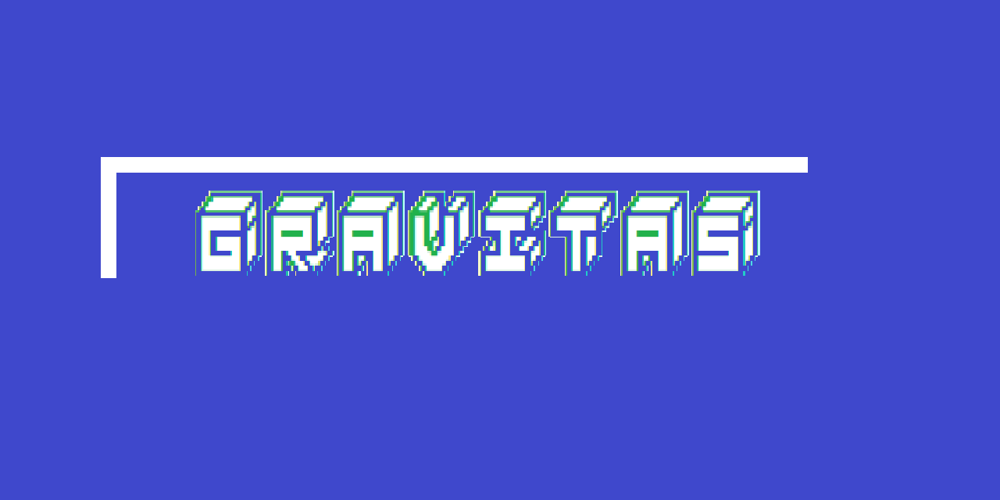



  

# `GRAVITAS`

A CLI-based todo list app to help you stay organized and focused.

Gravitas is a lightweight task manager built for the terminal. It lets you add tasks, view them, and keep your workflow calm and composed.

## Features

- Simple, keyboard-driven CLI experience
- Add tasks quickly
- Review your pending tasks at a glance
- Designed for minimal distraction

## Getting Started

1. Clone the repository:

>> git clone https://github.com/codewithraphael/gravitas.git

>> cd gravitas

2. Run the app:

>> python main.py

## Usage

When the app starts, you will see a menu with options:

- 1 Add Task
- 2 View Task
- 3 Delete Task
- 4 Exit

Follow the prompts to add a new todo or view your current list.

## Notes

- This is a simple proof-of-concept CLI todo app.
- Future improvements may include task persistence, editing, and completion tracking.

## License

This project is open source and free to use.
